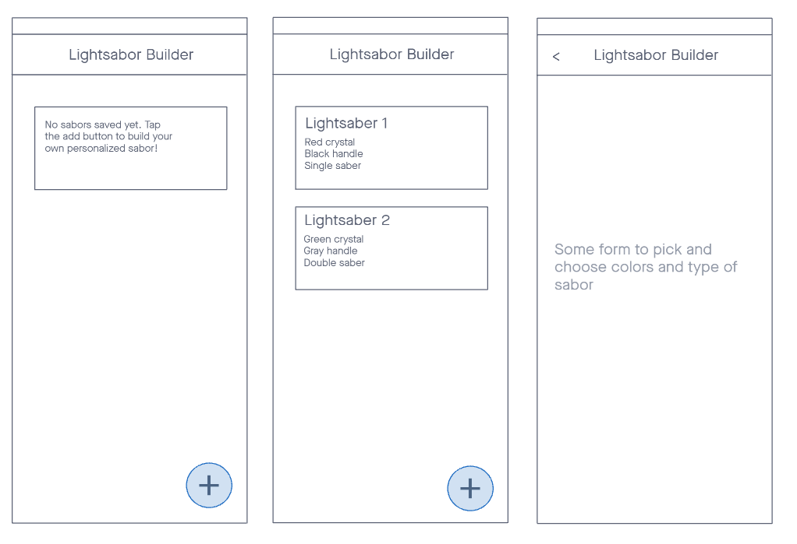

# Lightsaber Builder

#### An app that will let choose how to build your own personalized lightsaber. This is only to learn react-native and typescript and their intriquicies

## Setup

---

### Windows

1. Install [node with nvm](https://github.com/coreybutler/nvm-windows#nvm-for-windows), and install latest node version
1. Setup [Android dev env](https://reactnative.dev/docs/environment-setup?guide=native&platform=android&os=windows)

## Run it

---

Once all setup, you can `npm run start` and in a different terminal `npm run android`. That latter will open an android virtual device (no need to have Android studio running for this to work), and install the app on it ready to develop.

## Usefull VS Code extensions

- Better Comments
- Inline Parameters for VSCode
- Prettier - Code formatter
- Pretty TypeScript Errors

## Goal for this project

